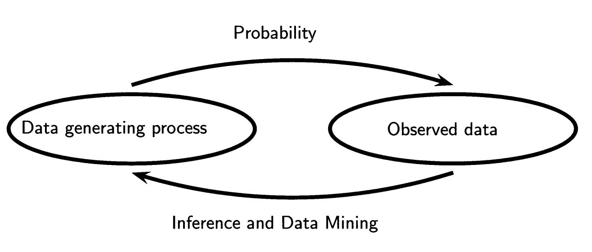

# Introduction to ML

[1] First we will study probability theory, the formal language of uncertainty which is the basis of statistical inference. The basic problem that we study in probability is:

- Given a data generating process, what are the properties of the out-
comes?

Then we will go through statistical inference and its cousins data mining and machine learning. The basic problem of statistical inference is the inverse of probability:

- Given the outcomes, what can we say about the process that generated the data?

[2]Machine learning is the study of algorithms that can learn from experience. As a machine
learning algorithm accumulates more experience, typically in the form of observational
data or interactions with an environment, its performance improves

#### References

1. Larry Wasserman - All of Statistics 
2. Dive into Deep Learning