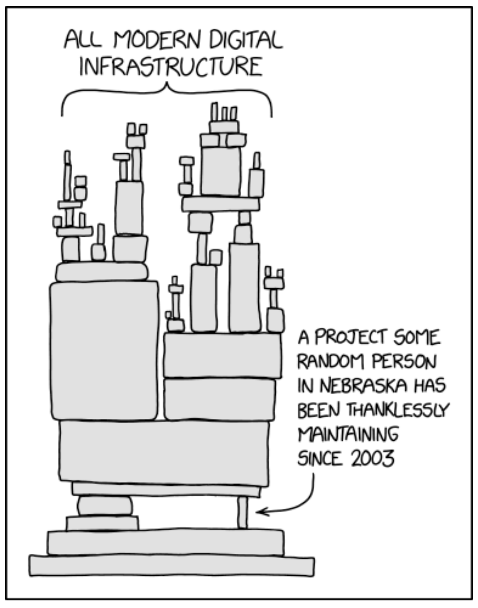

# RoadMap for Software Development

## Module 1

1. **Understand the Basics:**

   - Basics of computer architecture.
   - What is an OS.
   - What is coding and how code gets executed.
   - Stages of code execution: compilation, linking, execution.
   - Explore the fundamentals of software development.

2. **OS Fundamentals:**

   - Some deeper understanding of OS
   - Familiarize yourself with basic command-line operations.
   - Learn to navigate directories, create files, and execute commands
     [Refer here](Terminal.md).

3. **Version Control:**

   - Learn the basics of Git [Refer here](git-essentials.md) and GitHub.
   - Understand how version control works and its importance.

4. **Text Editors/IDEs:**

   - Choose a text editor or an Integrated Development Environment (IDE).
   - Popular choices include Visual Studio Code, Atom, or PyCharm.

5. **Choose a Programming Language:**

   - Start with a beginner-friendly language like Python or JavaScript.
   - Learn the syntax, data types, and basic concepts like conditions, looping etc.

6. **Basic Problem Solving:**
   - Practice solving small coding challenges.
   - Use platforms like HackerRank, LeetCode, or CodeSignal.

## Module 2

1. **Open source Vs Closed source software**

## [xkcd#2347](https://xkcd.com/2347/)

   - Free vs Open source

2. **Starting Open source development**

   - Revisit git
   - Github / Bitbucket
   - The linux foundation
   - Mozilla Foundation
   - The Apache Software Foundation
   - Electronic Frontier Foundation
   - Famous people?

3. **Agile**
   - Planning and Sprints
   - Scrum / Standups
   - Retro
   - Comparison to kanban

### References for Module 2

- [Producing Open Source Software](https://producingoss.com/)
   - [free pdf available](books/producingoss.pdf)
- [The Art of Community](https://www.jonobacon.com/books/artofcommunity/)

